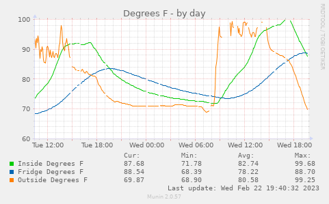
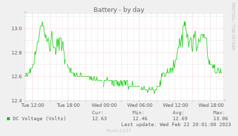

# rvwhisperclient
Python Client for [RV Whisper](https://rvwhisper.com/) API

This is a client for a potential API that [RV Whisper](https://rvwhisper.com/)
might someday implement. This is not an official client or affiliated in any
way with RV Whisper.

## CLI

To run the client as a CLI, first install the requirements
in your python3 environment of choice (virtualenv or whatever).
Eg.

```commandline
pip3 install -r requirements.txt
```

Then you can run the client to list your sensors. My RV Whisper
is on the local network at `192.168.86.99`...

```commandline
> ./client.py 192.168.86.99
541: Inside
542: Fridge
543: Outside
544: Propane
545: Battery
785: Power
```

And get the data for a particular sensor for the last 15 minutes...

```commandline
> ./client.py 192.168.86.99 544 -s 900
Propane:
Timestamp                    Tank Level (% Full)     Inches of LPG    Sensor Battery Status    RSSI (dB)  Sensor Status      Seconds Offline
-------------------------  ---------------------  ----------------  -----------------------  -----------  ---------------  -----------------
2023-02-19 11:46:03-06:00                     46               5.7                       32          -76  Active                           0
2023-02-19 11:51:05-06:00                     46               5.7                       32          -76  Active                           0
2023-02-19 11:56:07-06:00                     46               5.7                       32          -91  Active                           0
```

The client takes some other options:
```commandline
> ./client.py -h
usage: client.py [-h] [-s SECONDS] [-u | -j | -l] host [sensor ...]

positional arguments:
  host                  The hostname or IP address of your RV Whisper
  sensor                The numeric identifier of a sensor

optional arguments:
  -h, --help            show this help message and exit
  -s SECONDS, --seconds SECONDS
                        Number of seconds of history
  -u, --human           Output human readable (Default)
  -j, --json            Output JSON
  -l, --last            Output only last value
```


## Munin

Also included are a couple of scripts for use with the
[Munin monitoring](https://munin-monitoring.org/) system.
The `rvwhisper_sensor` script lets you make a graph for a single sensor.
The `rvwhisper_title` script lets you make a combined graph for a group
of sensors that have a data series with the same title.

I decided to not package the SensorClient as a library, so that these could
be just dropped in your munin directory (`/usr/share/munin/plugins` on my
system). You can set up graphs for individual
sensors by symlinking a plugin with the sensor ID:

```commandline
> ls -l /etc/munin/plugins
lrwxrwxrwx 1 root root 34 Feb 18 19:26 rvwhisper_541 -> /usr/share/munin/plugins/rvwhisper_sensor
lrwxrwxrwx 1 root root 34 Feb 18 19:26 rvwhisper_542 -> /usr/share/munin/plugins/rvwhisper_sensor
lrwxrwxrwx 1 root root 34 Feb 18 19:25 rvwhisper_543 -> /usr/share/munin/plugins/rvwhisper_sensor
lrwxrwxrwx 1 root root 34 Feb 18 20:04 rvwhisper_544 -> /usr/share/munin/plugins/rvwhisper_sensor
lrwxrwxrwx 1 root root 34 Feb 18 20:04 rvwhisper_545 -> /usr/share/munin/plugins/rvwhisper_sensor
lrwxrwxrwx 1 root root 34 Feb 18 20:04 rvwhisper_785 -> /usr/share/munin/plugins/rvwhisper_sensor
```


Or set up combined graphs by linking a "flattened" (lower case, just letters)
string to look for in the title:
```commandline
> ls -l /etc/munin/plugins
lrwxrwxrwx 1 root root 40 Feb 19 12:08 rvwhisper_degrees -> /usr/share/munin/plugins/rvwhisper_title
lrwxrwxrwx 1 root root 40 Feb 19 12:08 rvwhisper_humidity -> /usr/share/munin/plugins/rvwhisper_title
lrwxrwxrwx 1 root root 40 Feb 19 12:08 rvwhisper_sensorbattery -> /usr/share/munin/plugins/rvwhisper_title
```

The first one gets all of the "Degrees F" data from my temperature sensors
by looking for the string "degrees". The second gets all of the
"Relative Humidity (%)" data. The third gets "Sensor Battery Level (%)" from
my temperature sensors and "Sensor Battery Status" from my propane sensor.




To configure, add at least your host to `/etc/munin/plugin-conf.d/munin-node`:
```
[rvwhisper_*]
env.HOST 192.168.86.99
env.EXCLUDED Error Code,Sensor Status,RSSI (dB),Seconds Offline,Sensor Battery Level (%)
```
EXCLUDED is a comma-separated list of data series to not show in graphs. If a data
series has a title listed here, it will not be shown on an `rvwhisper_sensor`
graph.

GRAPH_ARGS passes the value to [rrdgraph](https://oss.oetiker.ch/rrdtool/doc/rrdgraph.en.html).
These settings are useful for values that vary over a small range, like battery voltages:
```commandline
env.GRAPH_ARGS --alt-autoscale --alt-y-grid
```

